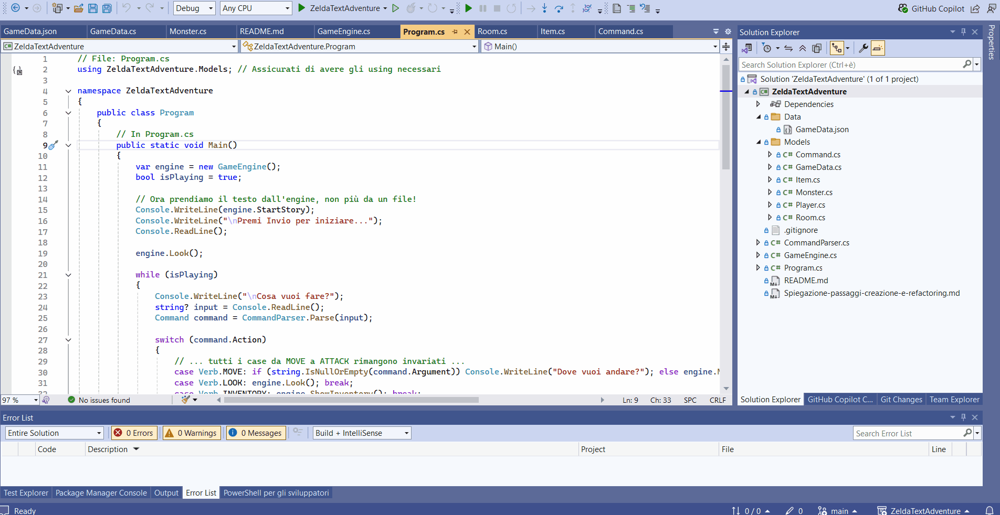

# 🛡️ Avventura testuale di Zelda


Un semplice gioco di avventura testuale ispirato a The Legend of Zelda, creato in C#. Questo progetto è stato sviluppato come esercizio per approfondire i concetti della programmazione orientata agli oggetti e le buone pratiche di architettura software.

## ✨ Features
* **Dati di gioco centralizzati:** l'intero mondo di gioco (storia, stanze, mostri, oggetti) è definito in un unico e pulito file `GameData.json`, rendendo il gioco facilmente configurabile e modificabile.
* **Sistema di gioco completo:** implementa tutte le meccaniche di base di un'avventura testuale: movimento, osservazione, gestione dell'inventario (`PICK`/`DROP`/`INVENTORY`) e un sistema di combattimento basato su oggetti.
* **Logica di vittoria e sconfitta:** il gioco ha molteplici finali a seconda delle azioni del giocatore, incluso il salvataggio della principessa.
* **Architettura software robusta:** il codice è stato attentamente rifattorizzato seguendo principi di singola responsabilità, con una netta separazione tra i vari componenti del gioco.

## 🏗️ Architettura del software
Il progetto è stato strutturato per essere pulito, mantenibile e scalabile. I componenti principali sono:
* **`Program.cs` (Il coordinatore):** gestisce il ciclo di gioco principale (`GameLoop`) e orchestra le interazioni tra l'utente e il motore di gioco.
* **`GameEngine.cs` (Il motore di gioco):** contiene tutto lo stato del gioco (`Player`, `World`) e la logica delle azioni (`Move`, `Attack`, etc.). Non si occupa di interpretare i comandi, ma solo di eseguirli.
* **`CommandParser.cs` (L'interprete):** ha la singola responsabilità di tradurre l'input testuale dell'utente in comandi strutturati e type-safe (usando un `enum`), disaccoppiando l'input dalla logica di gioco.
* **Cartella `Models`:** contiene tutte le classi che rappresentano le entità del gioco (`Player`, `Room`, `Item`, `Monster`, etc.), mantenendo i dati ben organizzati.
* **Cartella `Data`:** contiene il file `GameData.json`, unica fonte di verità per tutti i dati del mondo di gioco.

## 🚀 Come eseguire il progetto
Per compilare ed eseguire il gioco sul tuo computer, avrai bisogno di:
1.  [.NET 8 SDK](https://dotnet.microsoft.com/download/dotnet/8.0) (o superiore).
2.  clonare questo repository.
3.  navigare nella cartella del progetto ed eseguire il comando:
    ```bash
    dotnet run
    ```

## 🎮 Comandi di gioco
Controlla l'eroe con i seguenti comandi:

| Comando             | Esempio             | Descrizione                               |
| ------------------- | ------------------- | ----------------------------------------- |
| `LOOK`              | `LOOK`              | Descrive la stanza attuale e le uscite.   |
| `MOVE <direzione>`  | `MOVE NORTH`        | Ti sposta in una nuova stanza.            |
| `PICK <oggetto>`    | `PICK DAGGER`       | Raccoglie un oggetto dalla stanza.        |
| `DROP <oggetto>`    | `DROP CROSS`        | Lascia un oggetto nella stanza.           |
| `ATTACK`            | `ATTACK`            | Attacca il mostro presente nella stanza.  |
| `INVENTORY` / `I`   | `INVENTORY`         | Mostra il contenuto della borsa.          |
| `EXIT`              | `EXIT`              | Termina la partita con esito variabile.   |

## 🎥 Demo del Gioco



---
Sviluppato da **Marco Morello**